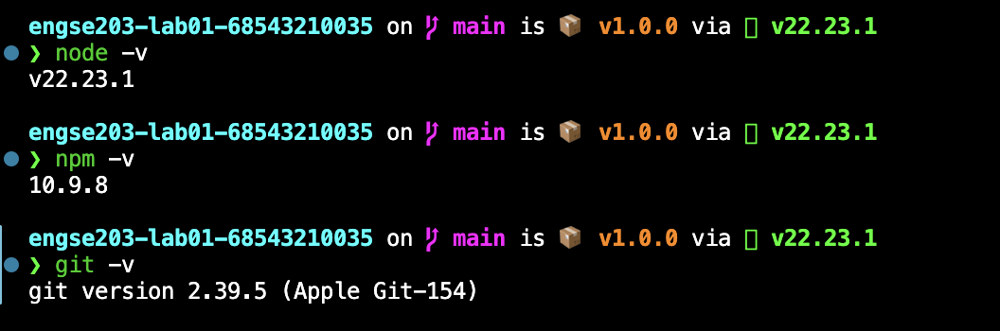

# Week 01 Evidence

ผลการัน hello.js

แสดงversion ของ node, npm, git

- Original Repository URL: https://github.com/beem35/engse203-lab01-68543210035
- Commit SHA: '65280c2'

# Reflection
ในปฏิบัติการนี้ได้ฝึกตั้งค่าสภาพแวดล้อมการทำงานและใช้งาน Git Workflow พื้นฐาน โดยเริ่มจากคัดลอก repository มายังเครื่องตนเอง ปรับแต่งไฟล์ตามโจทย์ จากนั้นใช้คำสั่ง  git add และ git commit บันทึกการเปลี่ยนแปลงอย่างเป็นสัดส่วน ก่อนส่งขึ้น GitHub ด้วย git push ทำให้เข้าใจลำดับการทำงานเวอร์ชันคอนโทรลได้ดียิ่งขึ้น