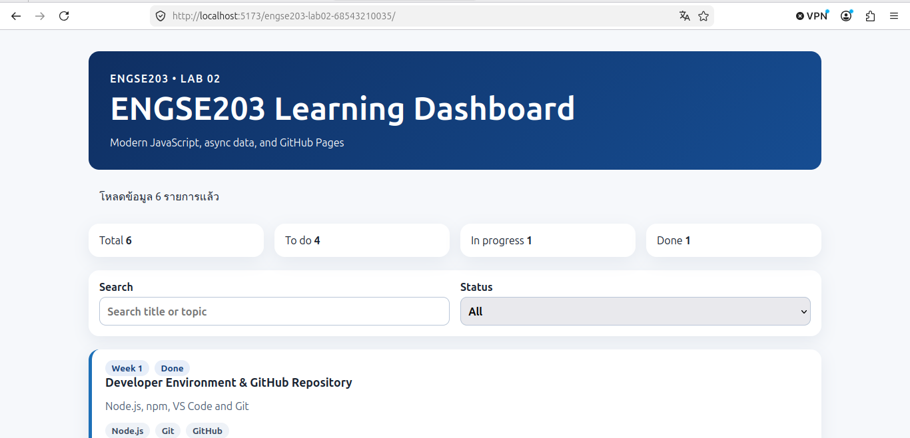
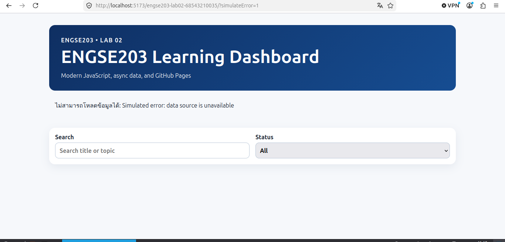
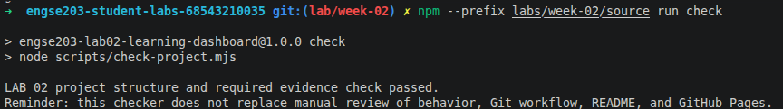
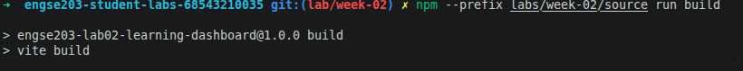

# Week 02 Evidence

## Reflection

การใช้ Vite ช่วยจัดการในเรื่องของโครงสร้างไฟล์และ Asset Path (ผ่าน `import.meta.env.BASE_URL` และ `vite.config.js`) ทำให้เมื่อนำผลลัพธ์ที่อยู่ในโฟลเดอร์ publish นี้ไปรวมกับ Lab อื่นๆ เพื่อแสดงผลบน GitHub Pages จึงสามารถทำงานได้สมบูรณ์ ไม่เกิดปัญหา Path 404 และสามารถทดสอบระบบจำลอง Error, ค้นหา และกรองข้อมูลได้อย่างมีประสิทธิภาพครับ

