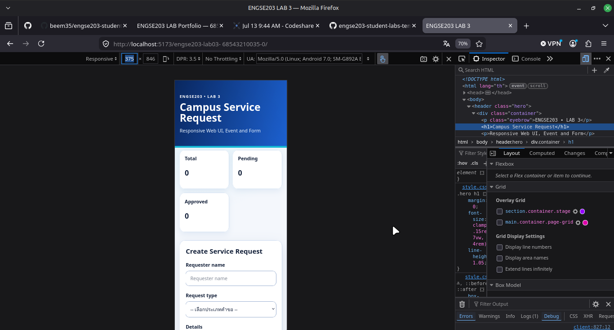
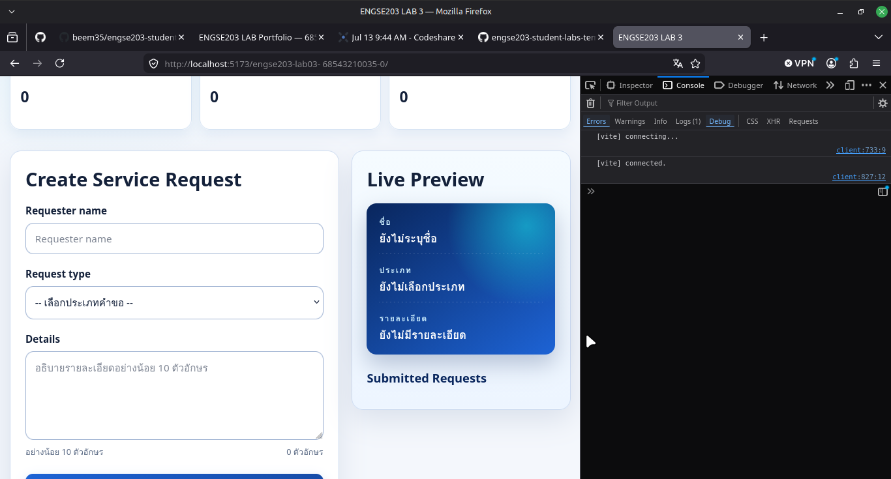

# Week 03 Evidence

ควรมี screenshots desktop/mobile, form valid/invalid และผล manual test

**1. หน้าเว็บเริ่มต้น (หน้าเว็บ.png)**  
แสดงส่วนต่อประสานผู้ใช้ (UI) เริ่มต้นที่ออกแบบให้ Responsive ประกอบไปด้วยแบบฟอร์มการขอรับบริการ, ส่วน Live Preview ด้านขวา, และการ์ดแสดงจำนวนสถานะด้านบน (Total, Pending, Approved) ซึ่งเริ่มต้นที่ 0

**2. หน้าเว็บเริ่มต้นในรูปแบบ Mobile (image-1.png)**  
แสดงการทดสอบ Responsive Design ในมุมมองของโทรศัพท์มือถือ (Mobile View) ผ่านเครื่องมือ DevTools โดยแสดงโครงสร้างที่ปรับให้เข้ากับหน้าจอขนาดเล็ก (เช่น 375px) ซึ่งยังคงแสดงข้อมูลส่วนหน้าเว็บและการ์ดสถานะได้อย่างถูกต้อง

**3. ระบบแจ้งเตือนข้อผิดพลาด (แจ้งเตือน.png)**  
แสดงระบบ Validation เมื่อผู้ใช้กด Submit โดยไม่ได้กรอกข้อมูล หรือกรอกไม่ครบตามเงื่อนไข (เช่น ตัวอักษรน้อยเกินไป) ระบบจะแสดงข้อความแจ้งเตือนสีแดง และเปลี่ยนขอบช่องกรอกเป็นสีแดง (Accessibility & Validation)

**4. การแสดงผลแบบเรียลไทม์ (กรอกข้อมูล.png)**  
แสดงระบบ Live Preview ที่เมื่อพิมพ์ข้อมูลลงในฟอร์ม ข้อมูลในกรอบ Live Preview ด้านขวาจะอัปเดตตามทันทีผ่านการดักจับอีเวนต์ `input`

**5. การแสดงรายการคำขอ (แสดงRequest.png)**  
แสดงผลลัพธ์เมื่อกรอกข้อมูลถูกต้องและกด Submit ระบบจะบันทึกและสร้างรายการคำขอ (List Item) แสดงอยู่ด้านล่างขวา พร้อมกับมีปุ่ม Approve ปรากฏขึ้นในแต่ละรายการ

**6. การอัปเดตจำนวนและสถานะ (แสดงจำนวนRequest.png)**  
แสดงการทำงานของตัวนับจำนวน (DOM Counter) เมื่อมีการเพิ่มคำขอใหม่ ยอด Total และ Pending จะเพิ่มขึ้น และหากกดปุ่ม Approve ปุ่มจะหายไป กล่องเปลี่ยนสี และยอด Approved จะเพิ่มขึ้นแทนที่

**7. การทดสอบและตรวจสอบผ่าน Browser Console (image.png)**  
แสดงหน้าจอการทดสอบบน Desktop พร้อมการเปิดหน้าต่าง Console (DevTools) เพื่อตรวจสอบสถานะการทำงานของระบบ เช่น การเชื่อมต่อกับ Vite Development Server สำเร็จ (`[vite] connected`) เพื่อช่วยในการดีบักและการทดสอบ Manual Test

## References & AI Assistance

- Source / Documentation: [ENGSE203 • Week 03 Sandbox v5 GitHub Pages Safe](https://se-rmutl.github.io/engse203/week03/sandbox/#web-ui), `ENGSE203_LAB03_Web_UI_Responsive_Form_ฉบับขยาย_v2.docx`, [LAB 3 — Starter](https://github.com/beem35/engse203-lab/tree/main/labs/week-03-responsive-ui/lab3/starter)
- AI tool used: Gemini (Google Antigravity)
- Used for: ขอคำปรึกษาเพื่อตรวจสอบและช่วยแก้ไขบั๊กการอัปเดต DOM สำหรับตัวนับ Request, แนะนำแนวทางการสร้างปุ่ม Approve ภายในรายการที่สร้างขึ้นใหม่ (Dynamic Element), และให้คำแนะนำด้าน Web Accessibility (A11y)
- My adaptation: นำคำแนะนำมาปรับใช้เพื่อแก้ไข `TypeError` จากการจัดการกับตัวแปรที่ว่างเปล่า (Undefined), จัดโครงสร้างฟังก์ชัน `updateStage()` ให้ถูกต้อง, และประยุกต์ใช้แนวคิดการเพิ่ม Class ผ่าน JavaScript เพื่อควบคุม Style
