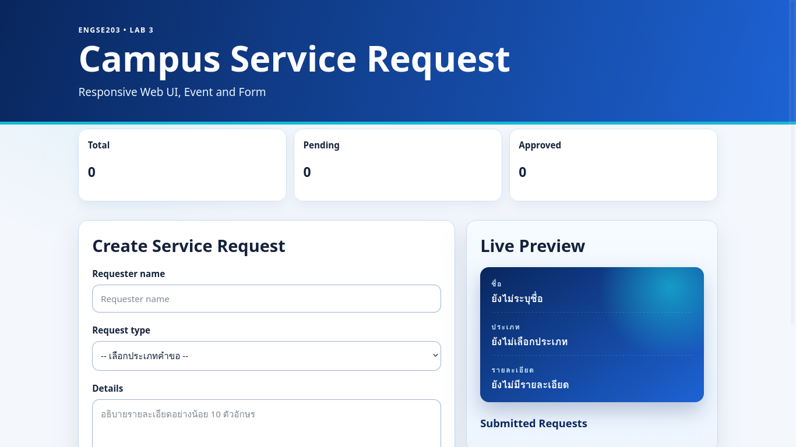
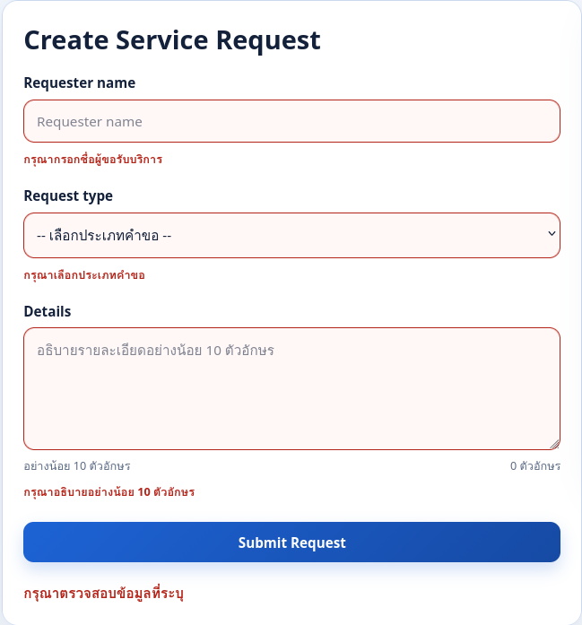
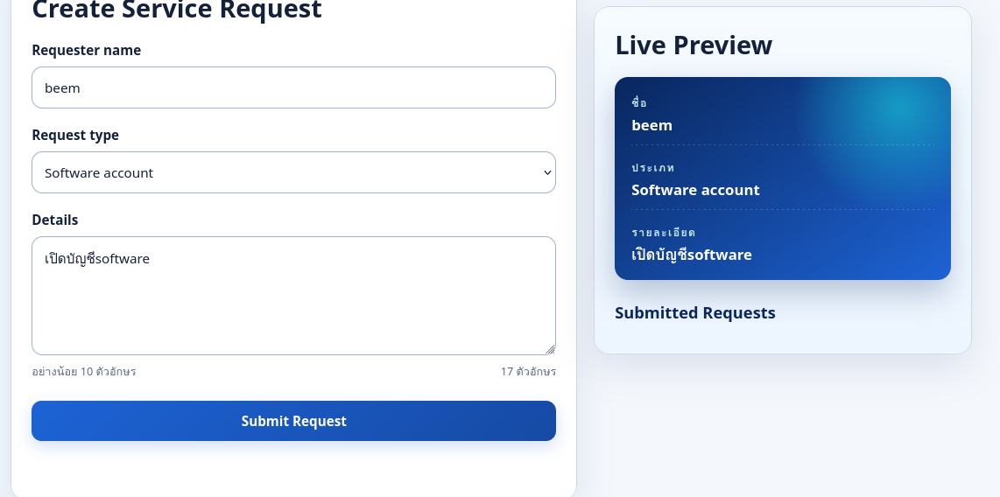
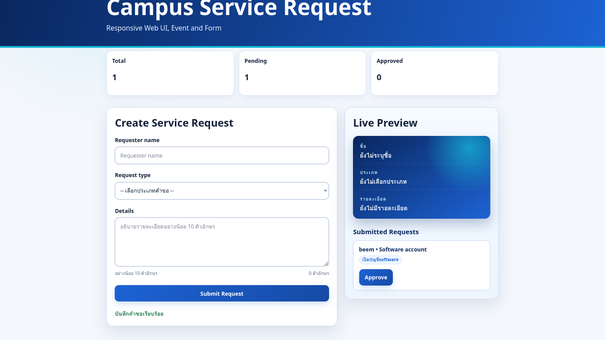
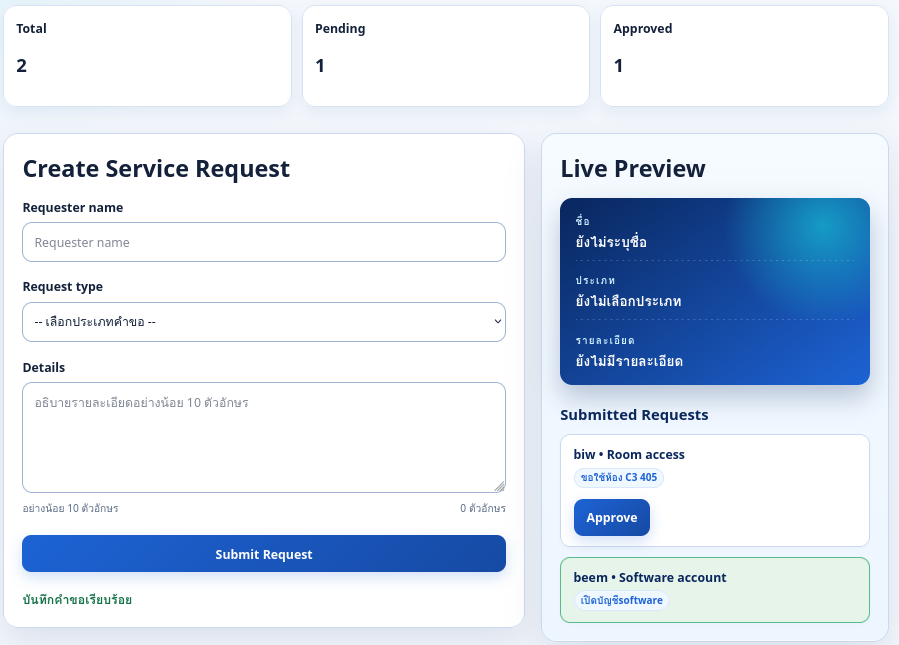

# ENGSE203 LAB 03 — Campus Service Request

## ผู้จัดทำ

- ชื่อ-นามสกุล: ปัณณวัฒน์ สิทธิตัน
- รหัสนักศึกษา: 68543210035-0
- ระบบปฏิบัติการที่ใช้: macOS / linuxMint

## วัตถุประสงค์ของงาน
เรียนรู้ Semantic HTML และ Accessibility, Responsive Layout, Event, Validation และ Feedback
- เรียนรู้การใช้งาน DOM API สำหรับการจัดการโครงสร้างและอัปเดตหน้าเว็บ (DOM Manipulation)
- เรียนรู้การดักจับและจัดการเหตุการณ์ (Event Handling) เช่น `input` สำหรับ Live Preview และ `submit` สำหรับการส่งฟอร์ม

## เครื่องมือที่ใช้
vscode npm git
- Vite (Development Server & Build Tool)
- HTML5, Vanilla CSS, JavaScript (ES6+)

## วิธีติดตั้งและรัน

```bash
# ติดตั้ง dependencies
npm install

# รัน Development Server
npm run dev
```

## โครงสร้างไฟล์

```text
.
├── src/
│   ├── main.js
│   └── style.css
├── docs/
├── package.json
├── index.html
└── README.md
```

## หลักฐานผลลัพธ์

อธิบายผลลัพธ์ พร้อมแนบภาพหน้าจอหรือข้อความผลลัพธ์ตามที่ใบงานกำหนด

**1. หน้าเว็บเริ่มต้น (หน้าเว็บ.png)**  
แสดงส่วนต่อประสานผู้ใช้ (UI) เริ่มต้นที่ออกแบบให้ Responsive ประกอบไปด้วยแบบฟอร์มการขอรับบริการ, ส่วน Live Preview ด้านขวา, และการ์ดแสดงจำนวนสถานะด้านบน (Total, Pending, Approved) ซึ่งเริ่มต้นที่ 0


**2. ระบบแจ้งเตือนข้อผิดพลาด (แจ้งเตือน.png)**  
แสดงระบบ Validation เมื่อผู้ใช้กด Submit โดยไม่ได้กรอกข้อมูล หรือกรอกไม่ครบตามเงื่อนไข (เช่น ตัวอักษรน้อยเกินไป) ระบบจะแสดงข้อความแจ้งเตือนสีแดง และเปลี่ยนขอบช่องกรอกเป็นสีแดง (Accessibility & Validation)


**3. การแสดงผลแบบเรียลไทม์ (กรอกข้อมูล.png)**  
แสดงระบบ Live Preview ที่เมื่อพิมพ์ข้อมูลลงในฟอร์ม ข้อมูลในกรอบ Live Preview ด้านขวาจะอัปเดตตามทันทีผ่านการดักจับอีเวนต์ `input`


**4. การแสดงรายการคำขอ (แสดงRequest.png)**  
แสดงผลลัพธ์เมื่อกรอกข้อมูลถูกต้องและกด Submit ระบบจะบันทึกและสร้างรายการคำขอ (List Item) แสดงอยู่ด้านล่างขวา พร้อมกับมีปุ่ม Approve ปรากฏขึ้นในแต่ละรายการ


**5. การอัปเดตจำนวนและสถานะ (แสดงจำนวนRequest.png)**  
แสดงการทำงานของตัวนับจำนวน (DOM Counter) เมื่อมีการเพิ่มคำขอใหม่ ยอด Total และ Pending จะเพิ่มขึ้น และหากกดปุ่ม Approve ปุ่มจะหายไป กล่องเปลี่ยนสี และยอด Approved จะเพิ่มขึ้นแทนที่


## ปัญหาที่พบและวิธีแก้ไข

- ปัญหา: ทำอย่างไรถึงสามารถนับจำนวน Request และให้ตัวเลขแสดงบนหน้าจอได้อย่างถูกต้อง
- วิธีแก้: ประกาศตัวแปรแบบ `let` (เช่น `total`, `pending`, `approved`) เพื่อนับจำนวน จากนั้นสร้างฟังก์ชัน `updateStage()` เพื่อนำค่าตัวเลขไปอัปเดตบนหน้าจอผ่าน `textContent` ของ DOM Element และเรียกใช้ฟังก์ชันนี้เมื่อมีการกดยืนยัน (Submit)
- ปัญหา: การลบปุ่ม Approve ออกเมื่อถูกกด และการเปลี่ยนสีกล่องรายการ
- วิธีแก้: สร้างปุ่ม Approve ภายในฟังก์ชัน `addRequest()` และผูก Event Listener `click` เพื่อให้เมื่อถูกกด ระบบจะลบปุ่มด้วยคำสั่ง `.remove()` และทำการเพิ่มคลาสให้กับกล่อง `<li>` ด้วย `.classList.add("approved")` เพื่อให้ CSS รับช่วงต่อในการเปลี่ยนสี

## References & AI Assistance

- Source / Documentation: [ENGSE203 • Week 03 Sandbox v5 GitHub Pages Safe](https://se-rmutl.github.io/engse203/week03/sandbox/#web-ui), `ENGSE203_LAB03_Web_UI_Responsive_Form_ฉบับขยาย_v2.docx`, [LAB 3 — Starter](https://github.com/beem35/engse203-lab/tree/main/labs/week-03-responsive-ui/lab3/starter)
- AI tool used: Gemini (Google Antigravity)
- Used for: ขอคำปรึกษาเพื่อตรวจสอบและช่วยแก้ไขบั๊กการอัปเดต DOM สำหรับตัวนับ Request, แนะนำแนวทางการสร้างปุ่ม Approve ภายในรายการที่สร้างขึ้นใหม่ (Dynamic Element), และให้คำแนะนำด้าน Web Accessibility (A11y)
- My adaptation: นำคำแนะนำมาปรับใช้เพื่อแก้ไข `TypeError` จากการจัดการกับตัวแปรที่ว่างเปล่า (Undefined), จัดโครงสร้างฟังก์ชัน `updateStage()` ให้ถูกต้อง, และประยุกต์ใช้แนวคิดการเพิ่ม Class ผ่าน JavaScript เพื่อควบคุม Style